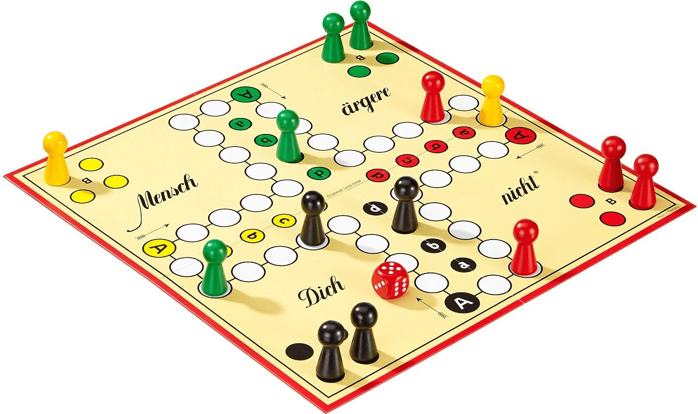

<h1 align="center"> Mensch </h1>

  

This project is a Python-based implementation of the classic German board game Mensch ärgere dich nicht ("Don't Get Angry"), developed using Tkinter for the GUI. It faithfully recreates the original gameplay with support for multiple players, dice rolling mechanics, turn-based movement, and collision rules for kicking opponents back to base. The project showcases structured game logic, user interaction handling, and dynamic visual updates—all within Python’s standard library, making it lightweight and easy to run across platforms.

## 📬 Contact

If you have any questions or feedback, feel free to contact us at:

📧 sepehrghamri@gmail.com